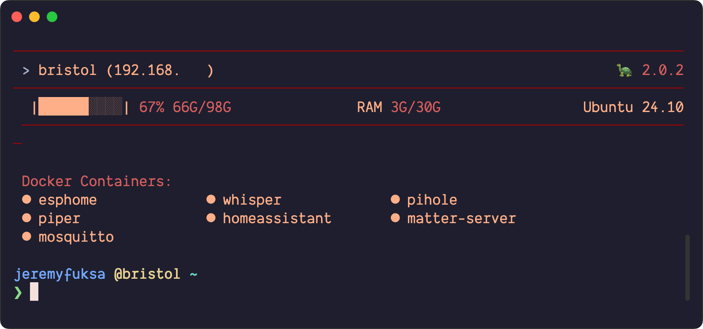
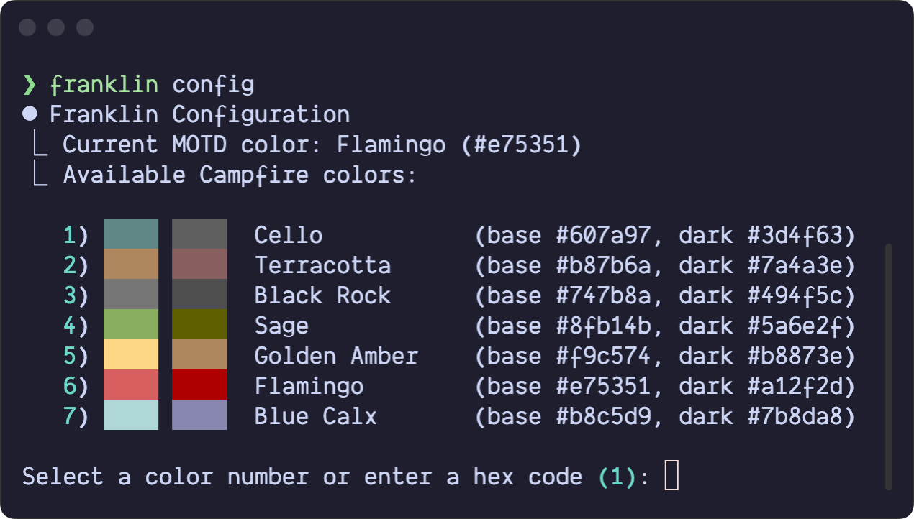

# Franklin 🐢

[](https://github.com/jeremyfuksa/franklin/releases)
[](LICENSE)
[](#franklin-starter-pack)
[](https://buymeacoffee.com/jeremyfuksa)

Franklin is a cozy Zsh shell setup inspired by the cartoon turtle you probably read about as a kid. He keeps your shell lightweight, consistent, and portable. macOS and Linux installs auto-detect the right package manager (brew/apt/dnf) so each flavor gets the correct fit.

## Quick Start

```bash
curl -fsSL https://raw.githubusercontent.com/jeremyfuksa/franklin/main/franklin/src/bootstrap.sh | bash
```

Pin a specific version and install path:

```bash
curl -fsSL https://raw.githubusercontent.com/jeremyfuksa/franklin/main/franklin/src/bootstrap.sh \
  | bash -s -- --dir "${HOME}/.local/share/franklin" --ref v2.0.0-beta-1
```

That's it—Franklin downloads his shell and gently asks about your preferred color palette along the way.



Need automation? Use the flags below.

| Layer | Flag | Description |
| --- | --- | --- |
| bootstrap | `--ref <branch\|tag>` | Install from a specific ref (default: `main`) |
| bootstrap | `--dir <path>` | Install location (default: `~/.local/share/franklin`) |

Franklin signature color names ([Campfire](https://github.com/jeremyfuksa/campfire) palettes): `clay`, `flamingo`, `terracotta`, `ember`, `golden-amber`, `hay`, `sage`, `moss`, `pine`, `cello`, `blue-calx`, `dusk`, `mauve-earth`, `stone`. You can pin `ember:clay`, `ash:cello`, or any `#rrggbb`.

Prefer cloning?

```bash
git clone https://github.com/jeremyfuksa/franklin ~/.config/franklin
cd ~/.config/franklin
bash install.sh
```

## Franklin Starter Pack

| Component | Notes |
| --- | --- |
| Zsh + Sheldon | Franklin keeps a tidy `.zshrc` and installs anything missing. |
| Starship prompt | Configured via `starship.toml`; auto-enabled for a snappy shell. |
| bat / batcat | Syntax-highlighted `cat` replacement; Franklin aliases `cat` ⇒ `bat`. |
| fzf, ripgrep | Included on Linux for quick fuzzy search and grepping. |
| NVM + Node LTS | Installed/pinned via `install.sh` & `update-all.sh`. |
| MOTD dashboard | Franklin Campfire banner with host/OS/disk/memory details. Toggle with `FRANKLIN_ENABLE_MOTD` / `FRANKLIN_SHOW_MOTD_ON_LOGIN`. |
| Fonts | MOTD status icons (``, ``, turtle) require a Nerd Font (e.g., Dank Mono Nerd Font). |
| Campfire UI palette | Non-banner UI chrome (install/update logs, badges) uses the Campfire palette (Cello/Terracotta/Black Rock) for consistent Franklin branding. |

Everything lives under your install dir (default `~/.local/share/franklin`) with configs in `~/.config/franklin`. The installer detects your OS (macOS, Debian/Ubuntu, Fedora, or any Linux with apt/dnf) and runs the appropriate setup. Before touching your existing setup, it backs up `.zshrc`, `.zshenv`, `.zprofile`, your sheldon config, and `~/.config/starship.toml` to `~/.local/share/franklin/backups/<timestamp>`.

## Daily Moves

| Command | Purpose |
| --- | --- |
| `update-all.sh` | Streams real-time progress while updating Franklin core files, OS packages (brew/apt/dnf), Sheldon plugins, Starship, Python, uv, NVM, Node, npm globals, and version pins. Detects your OS, filters noisy output in `auto` mode, and accepts `--mode=quiet|auto|verbose`. |
| `franklin` | Helper CLI wrapper; use `franklin update` for Franklin core only (via `update-franklin.sh`), `franklin update-all` for everything else, plus `franklin check`/`-v`. |
| `motd` | Renders the Franklin dashboard on demand; auto-runs at login unless disabled. |
| `reload` | Re-sources `.zshrc` after edits—Franklin's equivalent of poking his head out and checking his surroundings. |

## Customization

Franklin is designed to be customized. Here’s how you can make it your own.

### Shell Customization

The best way to add your own aliases, functions, and `PATH` adjustments is by editing `~/.franklin.local.zsh`. This file is loaded by Franklin's `.zshrc` but isn't managed by Franklin itself, so your changes won't be overwritten during updates.

The installer creates this file for you with some common examples to get you started.

To add custom shell plugins, edit `~/.config/sheldon/plugins.toml` and then run `sheldon lock`.

### Prompt

The prompt is powered by [Starship](https://starship.rs/). You can customize it by editing `~/.config/starship.toml`.

### Banner & MOTD



- **Banner Color**: Change the color of the Franklin banner with `franklin config --color <name|#hex>`. You can also edit `~/.config/franklin/config.env` directly. Franklin's signature colors are `clay`, `flamingo`, `terracotta`, `ember`, `golden-amber`, `hay`, `sage`, `moss`, `pine`, `cello`, `blue-calx`, `dusk`, `mauve-earth`, and `stone`.

- **MOTD Services**: To monitor `systemd` or `launchd` services in the MOTD dashboard, add their names to the `MONITORED_SERVICES` variable in `~/.config/franklin/config.env`. Docker containers are detected automatically.
  ```env
  # ~/.config/franklin/config.env
  MONITORED_SERVICES="nginx,postgresql,redis"
  ```

- **Disable MOTD**: To prevent the MOTD from showing on login, set `FRANKLIN_SHOW_MOTD_ON_LOGIN=0` in `~/.franklin.local.zsh`.

### Advanced Configuration

- **Update Behavior**: Control the default mode for `update-all.sh` by creating `~/.config/franklin/update.env`.
  ```env
  # ~/.config/franklin/update.env
  FRANKLIN_UPDATE_MODE=quiet # quiet, auto, or verbose
  FRANKLIN_UPDATE_TIMEOUT=600
  ```

- **Backup Location**: To change where Franklin stores backups of your old dotfiles, set the `FRANKLIN_BACKUP_DIR` environment variable *before* running the installer.
  ```bash
  export FRANKLIN_BACKUP_DIR=/path/to/your/backups
  # ... then run the installer
  ```

- **Local Overrides File**: If you want to store your local overrides in a different location than `~/.franklin.local.zsh`, set the `FRANKLIN_LOCAL_CONFIG` environment variable in your `.zshenv` file.

## Troubleshooting

| Issue | Fix |
| --- | --- |
| `update-all.sh` complains about missing package manager | Install Homebrew/apt/dnf, then rerun. |
| MOTD doesn’t show | Ensure `FRANKLIN_ENABLE_MOTD=1` and `FRANKLIN_SHOW_MOTD_ON_LOGIN=1`, then run `motd` to verify. |
| Wrong color | Prefer `franklin config --color <name|#hex>`; or edit `~/.config/franklin/config.env`. |
| Need to reinstall | Remove `~/.config/franklin` and `~/.local/share/franklin`, then rerun the bootstrapper. |
| Mixed stdout/stderr | UI logs go to stderr by design; pipe `franklin ... --json` output from stdout. |

## Development

Working on Franklin itself (not just using it)?

```bash
# Bootstrap smoke test (uses a GitHub-style archive from HEAD)
bash test/bootstrap-tests.sh

# Legacy installer tests (macOS-oriented)
bash test/test_install.sh
```

See [CONTRIBUTING.md](CONTRIBUTING.md) for coding style, release expectations, and PR guidelines.

## Release Workflow

For v2.x, releases are tagged and published on GitHub:

1. Ensure `CHANGELOG.md` has the new entry.
2. Update `VERSION` and `pyproject.toml`.
3. Tag (`vX.Y.Z`) and push; draft the GitHub release from the tag with summary notes.

## License & Credits

MIT License. Check out the source at [github.com/jeremyfuksa/franklin](https://github.com/jeremyfuksa/franklin).

Franklin stands on the shoulders of:
- [Sheldon](https://github.com/rossmacarthur/sheldon) for plugin management
- [Starship](https://github.com/starship/starship) for the prompt
- [NVM](https://github.com/nvm-sh/nvm) for Node versioning
